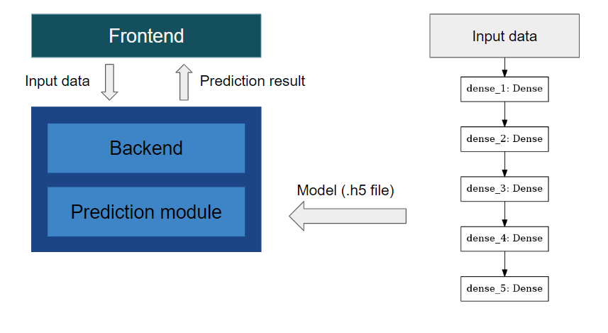

# psychological-conditions-prediction-system

> flask based psychological prediction system

This system is in charge of predicting the possibility of self-harm behavior.

## System structure
The system is composed of two components:
- System
- Model train script




## Run the system
To run, please refer to the command below:
```bash
# Using docker-compose
docker-compose build --no-cache
docker-compose up
```
## Enter the system
Check the data stored in the database with browser
```
http://[HOST]:8880
```